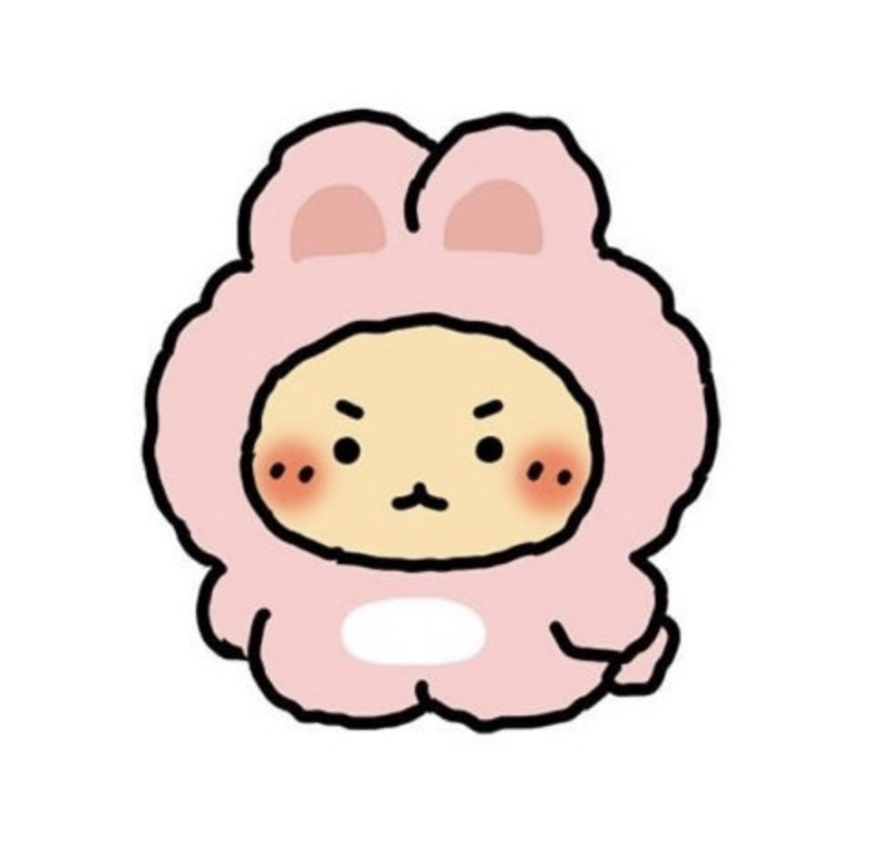

# 🌱 함께 자라기 - 애자일로 가는 길
**📚 함께 자라기 북 스터디**

|  |
| ------------------------------------------------------ |

 

## 📌 진행 방식 

- 스터디는 매주 일요일 20시 30분에 진행됩니다.
- 매주 정해진 분량 만큼 책을 읽은 후 내용 요약 및 느낀점을 정리하여 업로드합니다.
- 발표자의 진행에 따라 각 주제에 대한 자신의 생각을 공유합니다. 
  

 

## 📅 일정

<table>
<tbody>
<tr>
<td align="center" colspan="4">0주차</td>
</tr>
<tr>
<td align="center">1/5(일)</td>
<td colspan="3">OT 진행</td>
</tr>
<tr>
<td align="center" colspan="5">1주차</td>
</tr>
<tr>
<td align="center">1/12(일)</td>
<th align="left">9p~75p</th>
<td><a href="https://github.com/deep-dive-everything/growing-up-together/tree/main/1%EC%A3%BC%EC%B0%A8">정리</a></td>
<td>권현경</td>
</tr>
<tr>
<td align="center" colspan="5">2주차</td>
</tr>
<tr>
<td align="center">1/19(일)</td>
<th align="left">76p~105p</th>
<td><a href="https://github.com/deep-dive-everything/growing-up-together/tree/main/2%EC%A3%BC%EC%B0%A8">정리</a></td>
<td>박다솜</td>
</tr>
<tr>
<td align="center" colspan="5">3주차</td>
</tr>
<tr>
<td align="center">1/26(일)</td>
<th align="left">109p~189p</th>
<td><a href="https://github.com/deep-dive-everything/growing-up-together/tree/main/3%EC%A3%BC%EC%B0%A8">정리</a></td>
<td>고석영</td>
</tr>
<tr>
<td align="center" colspan="5">4주차</td>
</tr>
<tr>
<td align="center">2/2(일)</td>
<th align="left">193p~218p</th>
<td><a href="https://github.com/deep-dive-everything/growing-up-together/tree/main/4%EC%A3%BC%EC%B0%A8">정리</a></td>
<td>김해리</td>
</tr>
</tbody>
</table>

 

## 💕 스터디원 

<table>
<tbody>
<tr>
<td align="center"></td>
<td align="center"></td>
<td align="center"></td>
<td align="center"></td>
<td align="center"></td>
<td align="center"></td>
</tr>
<tr>
<th align="center">고석영</th>
<th align="center">권현경</th>
<th align="center">김해리</th>
<th align="center">박결</th>
<th align="center">박다솜</th>
<th align="center">이여진</th>
</tr>
<tr>
<td align="center" width="120"><a href="https://github.com/samseburn">@samseburn</a></td>
<td align="center" width="120"><a href="https://github.com/kwonhygge">@kwonhygge</a></td>
<td align="center" width="120"><a href="https://github.com/frogk">@frogk</a></td>
<td align="center" width="120"><a href="https://github.com/hotdog1004">@hotdog1004</a></td>
<td align="center" width="120"><a href="https://github.com/devsomda">@devsomda</a></td>
<td align="center" width="120"><a href="https://github.com/limejin">@limejin</a></td>
</tr>
</tbody>
</table>

